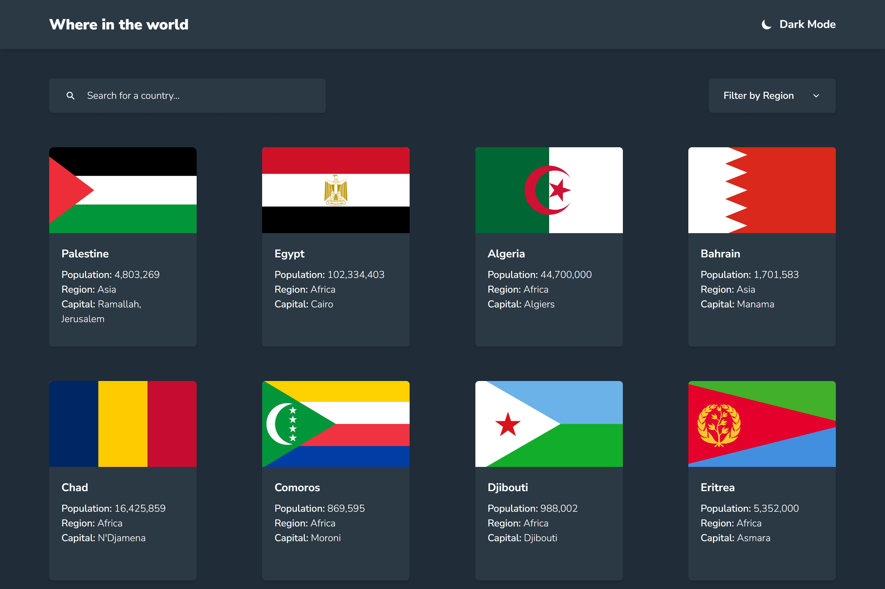

# REST Countries API with color theme switcher solution using VueJS

This is a solution to the [REST Countries API with color theme switcher challenge on Frontend Mentor](https://www.frontendmentor.io/challenges/rest-countries-api-with-color-theme-switcher-5cacc469fec04111f7b848ca).

## Table of contents

- [REST Countries API with color theme switcher solution using VueJS](#rest-countries-api-with-color-theme-switcher-solution-using-vuejs)
  - [Table of contents](#table-of-contents)
  - [Overview](#overview)
    - [The challenge](#the-challenge)
    - [Screenshot](#screenshot)
    - [Links](#links)
  - [My process](#my-process)
    - [Built with](#built-with)
    - [Useful resources](#useful-resources)
    - [Project Setup For running locally](#project-setup-for-running-locally)
      - [Compile and Hot-Reload for Development](#compile-and-hot-reload-for-development)
      - [Type-Check, Compile and Minify for Production](#type-check-compile-and-minify-for-production)
      - [Run Unit Tests with Vitest](#run-unit-tests-with-vitest)
      - [Lint with ESLint](#lint-with-eslint)
  - [Author](#author)

## Overview

### The challenge

Users should be able to:

- See all countries from the API on the homepage
- Search for a country using an `input` field
- Filter countries by region
- Click on a country to see more detailed information on a separate page
- Click through to the border countries on the detail page
- Toggle the color scheme between light and dark mode

### Screenshot



### Links

- [Solution URL](https://your-solution-url.com)
- [Live Site URL](https://your-live-site-url.com)

## My process

### Built with

- HTML5
- [TailwindCSS](https://tailwindcss.com)
- Flexbox
- CSS Grid
- [Vue](https://vuejs.org/) - JS library
- [Vue Router](https://router.vuejs.org/) - React framework
- [Pinia](https://pinia.vuejs.org/) - For styles

### Useful resources

- [custom `click-ouside` directive](https://stackoverflow.com/a/76281017) - This answer on StackOverflow helped know how to create a cusom `click-outside` directive that triggers an event when clicked ouside the parent element I used it to close the dropdown when clicking outside of it.
- [Data fetching after navigation](https://router.vuejs.org/guide/advanced/data-fetching.html#Fetching-After-Navigation) - This helped me understand how to fetch data after navigation in Vue Router.

### Project Setup For running locally

```sh
pnpm install
```

#### Compile and Hot-Reload for Development

```sh
pnpm dev
```

#### Type-Check, Compile and Minify for Production

```sh
pnpm build
```

#### Run Unit Tests with [Vitest](https://vitest.dev/)

```sh
pnpm test:unit
```

#### Lint with [ESLint](https://eslint.org/)

```sh
pnpm lint
```

## Author

- Website - [Omar Maoud Omar Mahmoud](https://github.com/omar-the-junior)
- Frontend Mentor - [@omar-the-junior](https://www.frontendmentor.io/profile/omar-the-junior)
- Twitter - [@omar_the_junior](https://www.twitter.com/omar_the_junior)
